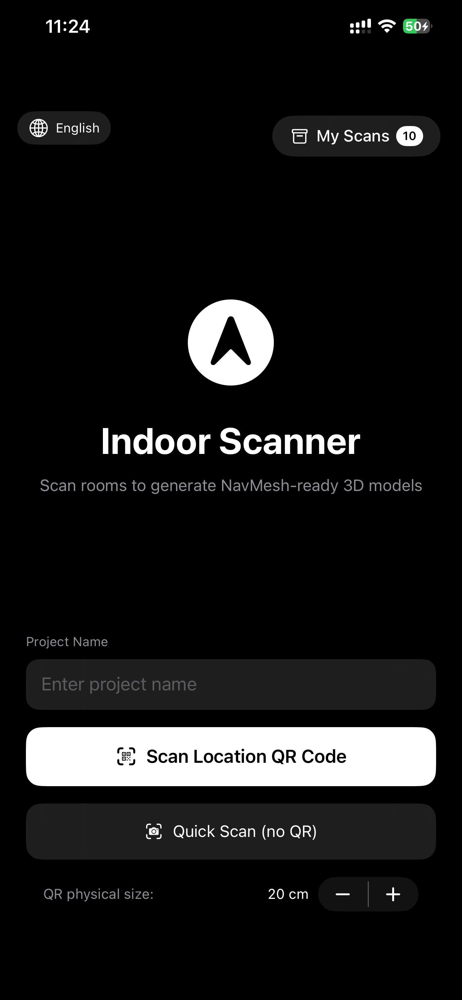
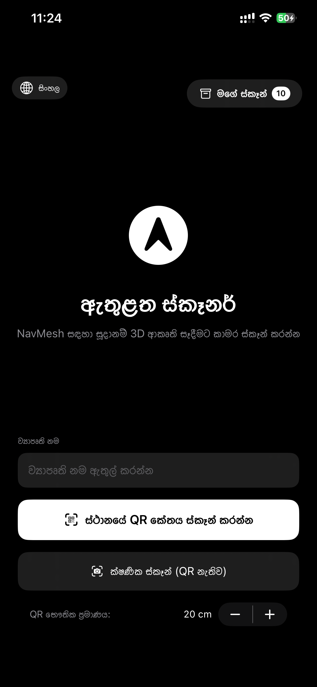
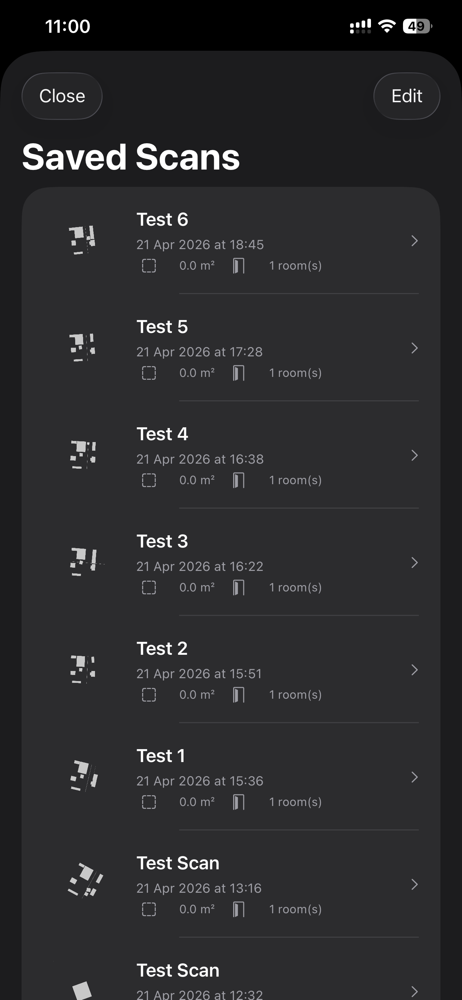
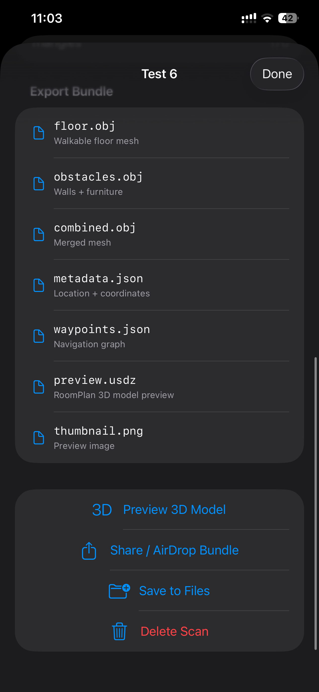

# Indoor Scanner

Indoor Scanner is an iOS app built with SwiftUI, RoomPlan, ARKit, and RealityKit to scan indoor spaces and produce navigation-ready 3D outputs.

The app is designed for workflows where you need:

- Multi-room scanning with LiDAR.
- Optional QR-based origin calibration for stable world alignment.
- Preview of the generated 3D model.
- Export bundles that can be consumed by engines like Unity/NavMesh pipelines.

## What this project does

Indoor Scanner captures room geometry on-device, merges rooms into one coordinate frame, generates simplified meshes and waypoint graphs, and exports a bundle containing geometry + metadata.

Main outputs include:

- `floor.obj`: walkable floor surface.
- `obstacles.obj`: obstacles from walls/furniture and supplemental LiDAR mesh.
- `combined.obj`: merged floor + obstacles.
- `metadata.json`: scan metadata and coordinate details.
- `waypoints.json`: navigation waypoint graph.
- `preview.usdz`: RoomPlan-native preview model.
- `thumbnail.png`: top-down thumbnail.

## Languages and frameworks used

- Language: Swift (Swift 5.0)
- UI: SwiftUI
- Spatial scanning: RoomPlan + ARKit
- 3D preview: RealityKit + QuickLook
- Rendering/thumbnail utilities: SceneKit
- Platform: iOS (deployment target 16.0)

## Requirements

- Xcode 15+ (recommended)
- iPhone/iPad with LiDAR support
- iOS 16.0 or newer
- Camera permission enabled

The app declares required device capabilities:

- `arkit`
- `lidar-depth`

## How it works (end-to-end flow)

1. Launch app on the idle screen.
2. Enter a project/location name.
3. Choose one of two start modes:
	- Scan location QR code (recommended for stable global alignment).
	- Quick scan (no QR, useful for testing).
4. Scan room with RoomPlan.
5. Add next room (optional) and continue scanning for multi-room stitching.
6. Preview model in 3D.
7. Run export pipeline.
8. Share bundle, save to Files, or keep in local scan library.

## QR calibration and coordinate system

When QR mode is used:

- QR pose is detected and locked as the global origin.
- Room transforms are converted to QR-relative coordinates.
- Metadata includes coordinate-system details for downstream consumers.

Export coordinate notes:

- Units: meters
- Source capture: ARKit right-handed coordinates
- Export metadata indicates Unity-friendly forward conventions

## Core processing pipeline

After scan stop/finalization:

1. Build final `CapturedRoom` via RoomBuilder.
2. Add room to stitcher in QR-relative space.
3. Merge geometry across rooms.
4. Deduplicate walls and generate floor/obstacle meshes.
5. Optionally enrich obstacles from ARKit mesh anchors.
6. Generate waypoint graph over free floor space.
7. Export OBJ/JSON/PNG/USDZ artifacts.
8. Zip bundle and save to local library.

## Project structure

Top-level modules in `IndoorScanner/`:

- `App/`: app entrypoint, global app state, localization manager.
- `UI/`: screens for home, QR capture, scanning, preview, export, and saved scans.
- `Scanning/`: RoomPlan session lifecycle + AR mesh supplementation.
- `Calibration/`: QR origin calibration and pose handling.
- `Stitching/`: merge multiple rooms into a unified geometry set.
- `Processing/`: mesh post-processing and waypoint graph generation.
- `Export/`: bundle creation, OBJ writing, metadata/waypoint serialization, validation.
- `Storage/`: disk streaming/session persistence and saved scan library.
- `Models/`: domain models (scanned room, saved record, waypoint graph, bounds).
- `Rendering/`: structured SceneKit renderer utilities.

## Localization

The app includes built-in localization strings for:

- English (`en`)
- Sinhala (`si`)
- Tamil (`ta`)

Language can be switched from the top-left language selector on the main screen.

## Saved scans and library behavior

Completed exports are stored under app documents storage (`SavedScans/<uuid>/`) with:

- `record.json` metadata
- `bundle.zip`
- `thumbnail.png` (if available)
- `preview.usdz` (if available)

Users can:

- Browse saved scans
- Open model preview
- Share/AirDrop bundle
- Save bundle to Files
- Delete scans

## Build and run

1. Open `IndoorScanner.xcodeproj` in Xcode.
2. Select an iOS device target that supports LiDAR.
3. Build and run the `IndoorScanner` scheme.
4. Grant camera permission when prompted.

## Notes and current limitations

- LiDAR is required for the intended scanning quality.
- iOS 17+ has better floor support via RoomPlan floor surfaces; iOS 16 uses fallback estimation in some paths.
- Very sparse scans can trigger incomplete-quality alerts and should be rescanned.

## Screenshots

